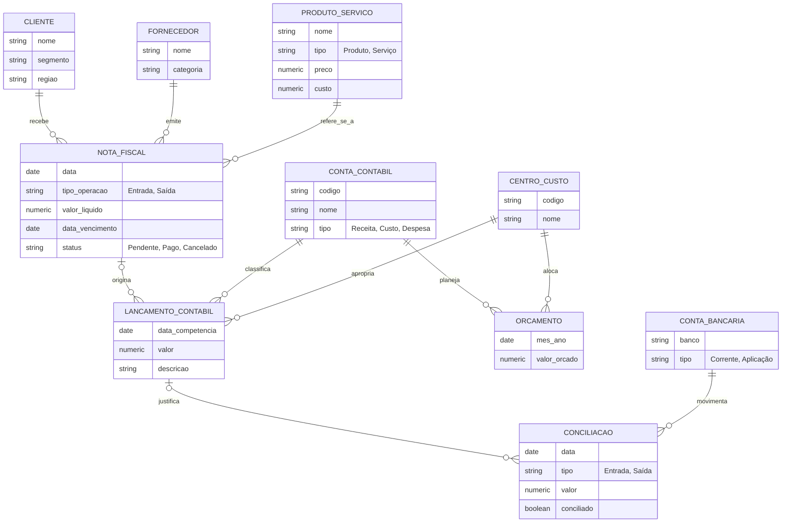

```mermaid
erDiagram
    %% ==========================================
    %% Relacionamentos (Documentos Fiscais)
    %% ==========================================
    CLIENTE ||--o{ NOTA_FISCAL : recebe
    FORNECEDOR ||--o{ NOTA_FISCAL : emite
    PRODUTO_SERVICO ||--o{ NOTA_FISCAL : refere_se_a

    %% ==========================================
    %% Relacionamentos (Lançamentos e Contabilidade)
    %% ==========================================
    NOTA_FISCAL |o--o{ LANCAMENTO_CONTABIL : origina
    CONTA_CONTABIL ||--o{ LANCAMENTO_CONTABIL : classifica
    CENTRO_CUSTO ||--o{ LANCAMENTO_CONTABIL : apropria

    %% ==========================================
    %% Relacionamentos (Orçamento)
    %% ==========================================
    CONTA_CONTABIL ||--o{ ORCAMENTO : planeja
    CENTRO_CUSTO ||--o{ ORCAMENTO : aloca

    %% ==========================================
    %% Relacionamentos (Fluxo de Caixa e Bancos)
    %% ==========================================
    LANCAMENTO_CONTABIL |o--o{ CONCILIACAO : justifica
    CONTA_BANCARIA ||--o{ CONCILIACAO : movimenta

    %% ==========================================
    %% Entidades e Atributos Conceituais
    %% ==========================================
    
    CLIENTE {
        string nome
        string segmento
        string regiao
    }

    FORNECEDOR {
        string nome
        string categoria
    }

    PRODUTO_SERVICO {
        string nome
        string tipo "Produto, Serviço"
        numeric preco
        numeric custo
    }

    NOTA_FISCAL {
        date data
        string tipo_operacao "Entrada, Saída"
        numeric valor_liquido
        date data_vencimento
        string status "Pendente, Pago, Cancelado"
    }

    CONTA_CONTABIL {
        string codigo
        string nome
        string tipo "Receita, Custo, Despesa"
    }

    CENTRO_CUSTO {
        string codigo
        string nome
    }

    LANCAMENTO_CONTABIL {
        date data_competencia
        numeric valor
        string descricao
    }

    ORCAMENTO {
        date mes_ano
        numeric valor_orcado
    }

    CONTA_BANCARIA {
        string banco
        string tipo "Corrente, Aplicação"
    }

    CONCILIACAO {
        date data
        string tipo "Entrada, Saída"
        numeric valor
        boolean conciliado
    }
```