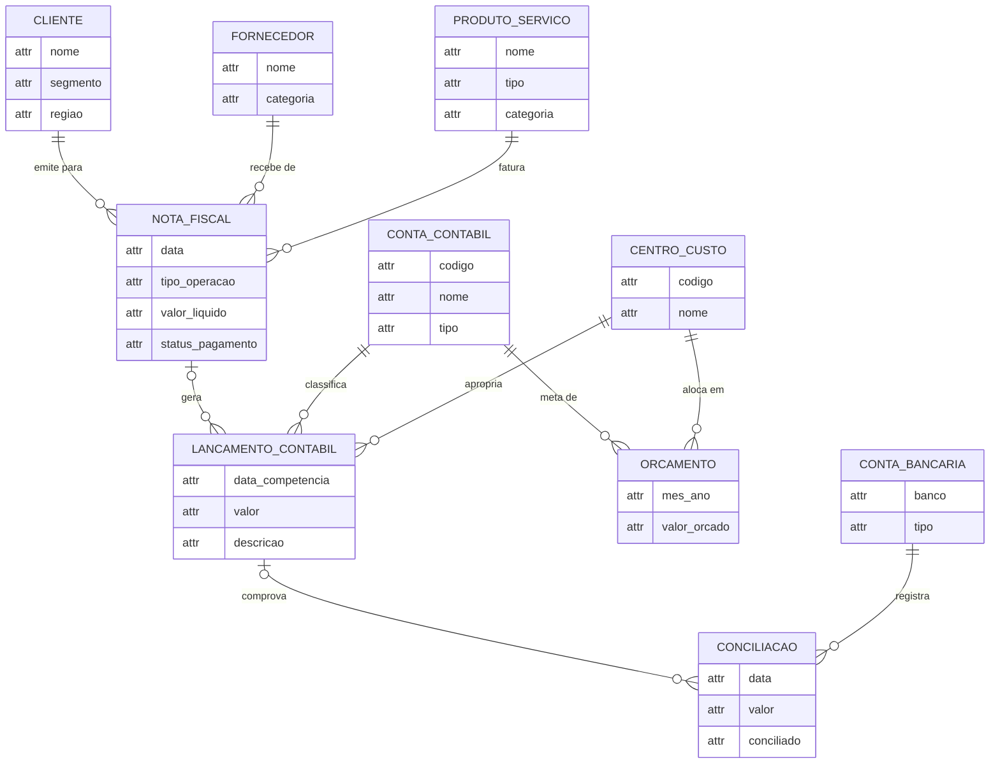

# Mermaid

```mermaid
erDiagram
    CLIENTE ||--o{ NOTA_FISCAL : "emite para"
    FORNECEDOR ||--o{ NOTA_FISCAL : "recebe de"
    PRODUTO_SERVICO ||--o{ NOTA_FISCAL : "fatura"

    NOTA_FISCAL |o--o{ LANCAMENTO_CONTABIL : "gera"
    CONTA_CONTABIL ||--o{ LANCAMENTO_CONTABIL : "classifica"
    CENTRO_CUSTO ||--o{ LANCAMENTO_CONTABIL : "apropria"

    CONTA_CONTABIL ||--o{ ORCAMENTO : "meta de"
    CENTRO_CUSTO ||--o{ ORCAMENTO : "aloca em"

    LANCAMENTO_CONTABIL |o--o{ CONCILIACAO : "comprova"
    CONTA_BANCARIA ||--o{ CONCILIACAO : "registra"

    CLIENTE {
        attr nome
        attr segmento
        attr regiao
    }

    FORNECEDOR {
        attr nome
        attr categoria
    }

    PRODUTO_SERVICO {
        attr nome
        attr tipo
        attr categoria
    }

    NOTA_FISCAL {
        attr data
        attr tipo_operacao
        attr valor_liquido
        attr status_pagamento
    }

    CONTA_CONTABIL {
        attr codigo
        attr nome
        attr tipo
    }

    CENTRO_CUSTO {
        attr codigo
        attr nome
    }

    LANCAMENTO_CONTABIL {
        attr data_competencia
        attr valor
        attr descricao
    }

    ORCAMENTO {
        attr mes_ano
        attr valor_orcado
    }

    CONTA_BANCARIA {
        attr banco
        attr tipo
    }

    CONCILIACAO {
        attr data
        attr valor
        attr conciliado
    }
```
